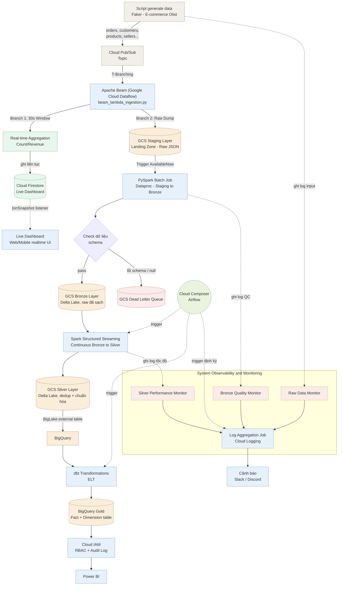

h

# Hybrid ELT Lakehouse Pipeline — Architecture (GCP)

### 1. Ingestion Layer (Pub/Sub & Apache Beam / Dataflow)

- **Data Generator:** Script Python (`stream_to_pubsub.py`) dùng thư viện Faker sinh dữ liệu giả lập (customers, orders, shipments...) và đẩy liên tục lên Cloud Pub/Sub.
- **Message Broker:** Cloud Pub/Sub (Topic: `ecommerce-events`) nhận luồng dữ liệu thô.
- **Real-time Ingestion (Apache Beam):** Script `beam_pubsub_to_raw.py` đóng vai trò là một Dataflow Pipeline. Nó hút dữ liệu liên tục từ Pub/Sub, áp dụng khái niệm **Fixed Window (Cửa sổ 30 giây)**. Cứ mỗi 30s, nó đóng gói toàn bộ sự kiện đã nhận thành các file NDJSON lớn và xả xuống tầng Landing Zone (Staging) theo từng thực thể, giải quyết triệt để vấn đề "Small Files Problem".
- **Landing Zone (Staging):** Khu vực đệm (`output/staging/`) chứa các file JSON thuần túy (Raw Data) trước khi đi vào Data Lake.

## 2. Diagram

---

## 2. Component breakdown

| Node ID        | Name                                        | Layer                    | Tech                                                    | Description                                                                                                                |
| -------------- | ------------------------------------------- | ------------------------ | ------------------------------------------------------- | -------------------------------------------------------------------------------------------------------------------------- |
| SCR            | Script generate data                        | Ingest                   | Python + Faker                                          | Sinh dữ liệu e-commerce giả lập (mô hình Olist), publish lên Pub/Sub                                                |
| PUB            | Cloud Pub/Sub Topic                         | Ingest                   | GCP Pub/Sub                                             | Message queue nhận dữ liệu từ generator                                                                                |
| STG            | GCS Staging Layer (Landing Zone)            | Storage                  | GCS                                                     | Lưu trữ nguyên bản JSON thô từ Pub/Sub (Vùng đệm an toàn)                                                        |
| SPARK1         | PySpark Batch Job                           | Processing               | Spark Structured Streaming,`Trigger.AvailableNow`     | Đọc từ Staging, validate schema (mode PERMISSIVE), phân tách bản ghi đúng/sai                                      |
| CHK            | Check dữ liệu schema                      | Processing               | Spark schema validation                                 | Rẽ nhánh qua biến`_corrupt_record`                                                                                    |
| BRONZE         | GCS Bronze Layer                            | Storage                  | GCS + Delta Lake (`mergeSchema=true`)                 | Raw data đã qua schema check, giữ nguyên cấu trúc gốc                                                               |
| DLQ            | GCS Dead Letter Queue                       | Storage                  | GCS                                                     | Lưu bản ghi lỗi schema/null để xử lý sau                                                                            |
| RTAGG          | Real-time Aggregation                       | Processing (Speed Layer) | Apache Beam (Dataflow)                                  | Window aggregate (count/revenue) tách nhánh từ Ingestion                                                                |
| RTFS           | Cloud Firestore                             | Storage (real-time)      | Firestore                                               | Nhận ghi liên tục từ RTAGG                                                                                             |
| RTDASH         | Live Dashboard                              | Serving                  | Web/Mobile UI +`onSnapshot()` listener                | Hiển thị số liệu real-time khi nhánh RTAGG đang bật                                                                 |
| SPARK2         | Spark Structured Streaming (Bronze→Silver) | Processing               | Spark Structured Streaming,`Trigger.AvailableNow`     | Dedup (`dropDuplicates` + `withWatermark`), `Left Outer Join` cho early-arriving fact, chuẩn hóa                   |
| SILVER         | GCS Silver Layer                            | Storage                  | GCS + Delta Lake (`mergeSchema=true`)                 | Dữ liệu đã dedup + chuẩn hóa                                                                                         |
| BQ             | BigQuery                                    | Warehouse                | BigQuery + BigLake external table                       | Đọc trực tiếp Silver layer từ GCS                                                                                     |
| DBT            | dbt Transformations                         | Transform                | dbt-bigquery,`on_schema_change: 'append_new_columns'` | ELT: staging → fact/dimension, Inferred Dimension cho`dim_product`, incremental merge cho `fact_shipments`            |
| GOLD           | BigQuery Gold                               | Warehouse                | BigQuery (fact/dimension tables)                        | `fact_orders`, `fact_order_items`, `fact_shipments`, `dim_customer`, `dim_product`, `dim_seller`, `dim_date` |
| IAM            | Cloud IAM                                   | Security                 | RBAC + Row-Level Security + Data Masking + Audit Log    | RLS trên`fact_orders` theo `seller_id`, masking trường `email`                                                    |
| BI             | Power BI                                    | Serving                  | Power BI                                                | Báo cáo phân tích trên Gold layer                                                                                     |
| AF             | Cloud Composer (Airflow)                    | Orchestration            | Airflow DAGs                                            | Trigger SPARK2 (AvailableNow theo lịch), DBT, LOGAGG, DAG compact/vacuum ban đêm                                        |
| MON1/MON2/MON3 | Monitors                                    | Observability            | Custom log emitters                                     | Log input / QC / tốc độ xử lý ở từng tầng                                                                          |
| LOGAGG         | Log Aggregation Job                         | Observability            | Cloud Logging                                           | Gom log từ MON1-3                                                                                                         |
| ALERT          | Cảnh báo                                  | Observability            | Slack/Discord Webhook                                   | Nhận cảnh báo từ LOGAGG                                                                                                |

---

## 3. Data flow (thứ tự xử lý)

1. `SCR` sinh dữ liệu Faker → publish lên `PUB`.
2. Dữ liệu từ `PUB` được dump toàn bộ thành file JSON thô vào thư mục `STG` (Staging Layer) để làm vùng đệm.
3. `SPARK1` đọc từ `STG` dưới dạng luồng (stream), validate schema (`CHK`):
   - Pass (`_corrupt_record` is null) → ghi `BRONZE` (Delta Lake)
   - Fail (`_corrupt_record` is not null) → ghi `DLQ` (JSON)
   - Song song: aggregate theo window → `RTAGG` (job riêng) → ghi `RTFS` (Firestore) → push real-time xuống `RTDASH`.
4. `SPARK2` đọc `BRONZE` (continuous hoặc AvailableNow, trigger bởi `AF`): dedup (`dropDuplicates` + `withWatermark`), `Left Outer Join` xử lý early-arriving fact, chuẩn hóa → ghi `SILVER`.
5. `SILVER` được expose vào `BQ` qua BigLake external table.
6. `AF` trigger `DBT` chạy ELT: staging (dedup bằng `ROW_NUMBER()`) → fact/dimension ở `GOLD`, bao gồm Inferred Dimension (`dim_product`) và incremental merge (`fact_shipments`, `unique_key='shipment_id'`).
7. `GOLD` áp dụng `IAM` (RBAC, Row-Level Security theo `seller_id`, Data Masking cho `email`, Audit Log) trước khi expose ra `BI` (Power BI).
8. Song song toàn bộ pipeline: `MON1/2/3` ghi log ở từng tầng → `LOGAGG` gom log → `ALERT` báo Slack/Discord khi có bất thường.
9. `AF` (Cloud Composer) điều phối lịch: bật/tắt cluster Dataproc cho `SPARK2`, trigger `DBT`, trigger `LOGAGG`, và chạy DAG compact (`OPTIMIZE`) + `VACUUM` ban đêm cho Bronze/Silver.

---

## 4. Domain schema (Faker — mô phỏng Olist)

| Bảng           | Field chính                                                                                                                  |
| --------------- | ----------------------------------------------------------------------------------------------------------------------------- |
| `customers`   | customer_id, city, state, zip_code                                                                                            |
| `orders`      | order_id, customer_id, order_status, purchase_timestamp, approved_timestamp, delivered_timestamp                              |
| `order_items` | order_id, product_id, seller_id, price, freight_value                                                                         |
| `products`    | product_id, category, weight, dimensions                                                                                      |
| `sellers`     | seller_id, city, state                                                                                                        |
| `payments`    | order_id, payment_type, installments, payment_value                                                                           |
| `reviews`     | review_id, order_id, review_score, comment                                                                                    |
| `shipments`   | shipment_id, order_id, carrier, tracking_number, shipping_status, shipped_date, estimated_delivery_date, actual_delivery_date |
