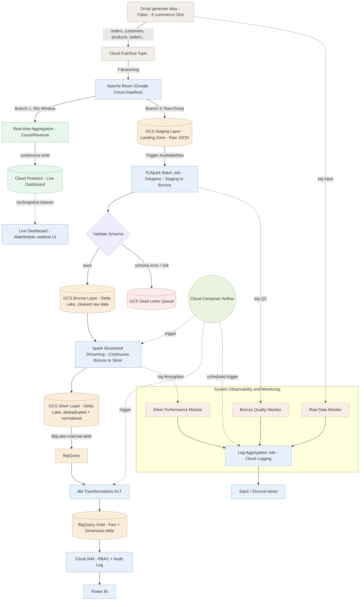

# 🚀 E-Commerce Hybrid ELT Lakehouse Pipeline on Google Cloud


A complete, production-ready Hybrid ELT Lakehouse architecture built natively on Google Cloud Platform (GCP). This repository demonstrates an enterprise-grade data engineering pipeline that processes streaming E-Commerce data using a **Multi-Layered Medallion Architecture (Bronze → Silver → Gold)**, featuring built-in Data Quality controls, Change Data Capture (CDC), and a Dead Letter Queue (DLQ) mechanism.

## 📑 Table of Contents

- [Technical Architecture Diagram](#️-technical-architecture-diagram)
- [Component Breakdown &amp; Data Flow](#️-component-breakdown--data-flow)
- [Multi-Layer Defense in Action](#️-multi-layer-defense-in-action-error-handling)
- [Technology Stack](#️-technology-stack)
- [Project Structure](#-project-structure)
- [How to Run](#-how-to-run)
- [License](#-license)

## 🏗️ Technical Architecture Diagram



---

## ⚙️ Component Breakdown & Data Flow

### 1. Ingestion Layer (Pub/Sub & Dataflow)

- **Data Generator:** A custom Python script (`stream_to_pubsub.py`) uses the Faker library to simulate an Olist-style E-commerce system (8 entities including Customers, Orders, CDC Shipments, etc.).
- **Message Broker (Pub/Sub):** Receives the high-throughput, real-time raw data stream.
- **Staging / Landing Zone (GCS):** Dataflow (or local puller script) consumes messages from Pub/Sub and buffers them into NDJSON files stored in GCS `staging/`. This solves the "Small Files Problem" early in the pipeline.

### 2. Processing Layer: Dataproc (Apache Spark & Delta Lake)

- **Bronze Layer (Schema Validation):**
  - `stream_raw_to_bronze.py` leverages Spark Structured Streaming with `Trigger.AvailableNow` to process Staging data.
  - 🛡️ **Schema Defense:** Uses Spark's `PERMISSIVE` mode. Records failing schema enforcement (e.g., passing a String into a Float column) are caught via `_corrupt_record` and isolated into the **Dead Letter Queue (DLQ)**. Valid records are appended to the Bronze Delta tables.
- **Silver Layer (Data Quality & CDC Deduplication):**
  - `stream_bronze_to_silver.py` streams from Bronze to Silver.
  - 🛡️ **Data Quality Defense:** Imputes missing values (e.g., filling `Null` emails with a default string) and performs deduplication on CDC events using `Window` functions to retain only the latest state (e.g., Shipment statuses).
  - Uses Delta Lake `MERGE` (Upsert) to maintain an accurate Silver state.

### 3. Analytics Layer: dbt & BigQuery (Gold)

- **BigLake Integration:** BigQuery accesses the Silver Delta Lake files on GCS via External Tables, achieving a true zero-copy architecture.
- **dbt (Data Build Tool):** Executes ELT transformations directly inside BigQuery.
  - 🛡️ **Business Logic Defense:** `stg_order_items.sql` enforces business rules (e.g., `WHERE price > 0`) to filter out anomalies that were structurally valid but logically incorrect.
  - Generates the final Star Schema (Facts and Dimensions) optimized for BI consumption.

---

## 🛡️ Multi-Layer Defense in Action (Error Handling)

This project intentionally generates a small percentage of corrupted data to demonstrate the robustness of the Medallion architecture:

1. **Schema Errors (1-2%)**: Data Generator produces Type Mismatches (e.g., Dict instead of String).
   - **Result**: Caught by **Bronze Layer** (PySpark) -> Routed to **DLQ** as raw JSON.
2. **Missing Values (1-2%)**: Data Generator omits required fields (e.g., Null Emails).
   - **Result**: Passed by Bronze, caught by **Silver Layer** (PySpark) -> Automatically imputed/cleaned via Data Quality rules.
3. **Business Logic Errors (1-2%)**: Data Generator produces negative prices (`-999.99`).
   - **Result**: Passed by Bronze & Silver, caught by **Gold Layer** (dbt) -> Filtered out via SQL `WHERE` clauses before analytical aggregations.

---

## 🛠️ Technology Stack

| Category                        | Technology                     |
| ------------------------------- | ------------------------------ |
| **Cloud Provider**        | Google Cloud Platform (GCP)    |
| **Message Broker**        | Cloud Pub/Sub                  |
| **Stream Processing**     | Cloud Dataflow (Apache Beam)   |
| **Data Lake Storage**     | Google Cloud Storage (GCS)     |
| **Data Processing (ETL)** | Dataproc Serverless (PySpark)  |
| **Table Format**          | Delta Lake (ACID Transactions) |
| **Data Warehouse**        | Google BigQuery + BigLake      |
| **Data Transformation**   | dbt (Data Build Tool)          |
| **Language**              | Python 3.10+, SQL              |

## 📂 Project Structure

```text
├── data_generator/         # Custom E-commerce Data Generator (8 Entities + CDC)
│   ├── config.py           # Generator configuration and schemas
│   ├── generators.py       # Entity generation logic (includes dirty data injection)
│   └── stream_to_pubsub.py # Publishes generated events to GCP Pub/Sub
│
├── spark_jobs/             # PySpark ETL Jobs for Dataproc Serverless
│   ├── config.py           # Spark configurations and table schemas
│   ├── stream_raw_to_bronze.py    # Staging (JSON) -> Bronze (Delta) + DLQ Routing
│   ├── stream_bronze_to_silver.py # Bronze -> Silver (Delta MERGE + Data Cleaning)
│   ├── pull_pubsub_to_raw.py      # Local script to pull Pub/Sub to Staging (Fallback)
│   └── deploy_to_dataproc.py      # Automates submitting PySpark batches
│
├── dbt_transform/          # dbt project for Gold Layer analytics
│   ├── dbt_project.yml
│   ├── profiles.yml        # Configured to target BigQuery (`lakehouse_gold`)
│   └── models/
│       ├── staging/        # Views on top of Silver External Tables (Business Filters)
│       └── marts/          # Fact & Dimension tables (Star Schema)
```

## 📊 Cloud Operations & Observability

To demonstrate the cloud-native capabilities of this pipeline, the system is fully integrated with Google Cloud operations suite. Below are the key operational views (Add your screenshots here):

### 1. Centralized Logging & Metrics (Cloud Monitoring)

The pipeline implements a **Zero-Overhead custom logging mechanism** in PySpark to track Data Quality (Bronze) and Processing Performance (Silver) in real-time.

### 2. Stream Processing (Dataflow)

<!--  -->

*3. Serverless Spark Execution (Dataproc)*


<!--  -->

### 4. Data Warehouse & Transformation (BigQuery + dbt)


<!--  -->

---

## 🚀 How to Run

1. **Setup GCP & Infrastructure**: Ensure Pub/Sub, GCS bucket, and BigQuery datasets (`lakehouse_silver`, `lakehouse_gold`) are created.
2. **Start the Data Generator**:
   `python data_generator/stream_to_pubsub.py`
3. **Run Dataproc Spark Jobs**:
   `python spark_jobs/deploy_to_dataproc.py`
4. **Build Gold Layer (dbt)**:
   `cd dbt_transform && dbt run`
