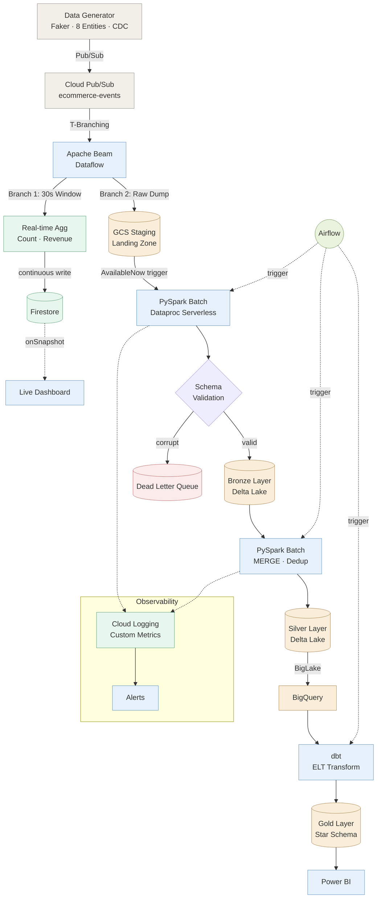

# Hybrid ELT Lakehouse Pipeline on Google Cloud

**A production-grade, end-to-end data lakehouse that ingests streaming Vietnamese e-commerce events through a Medallion Architecture (Bronze → Silver → Gold), combining near-real-time dashboards with batch analytics — all orchestrated on GCP.**

---

## Business Value

### The Scenario

An e-commerce marketplace (modeled after **Olist — Brazil's largest department store marketplace**) processes **thousands of orders per day** across multiple regions. Data is continuously generated using Faker to simulate 8 entity types (customers, orders, payments, shipments, etc.) with realistic distributions. The business has two critical data needs that traditionally require separate systems:

1. **Operations Team** needs a **live dashboard** showing real-time order counts and revenue — especially during flash-sale events where decisions on inventory restocking and promotion adjustments must happen within seconds, not hours.
2. **Analytics Team** needs a **clean, reliable data warehouse** with deduplicated, normalized tables for daily sales reports, customer segmentation, and logistics performance analysis via Power BI.

### What This Pipeline Delivers

| Stakeholder                  | What They Get                                                                                          | How                                                    |
| ---------------------------- | ------------------------------------------------------------------------------------------------------ | ------------------------------------------------------ |
| **Operations Manager** | Live revenue & order count updating every 30 seconds                                                   | Apache Beam → Firestore → Real-time Web Dashboard    |
| **Data Analyst**       | Clean Star Schema tables (`fact_orders`, `dim_customers`, `fact_shipments`) ready for BI         | Spark → Delta Lake → dbt → BigQuery → Power BI     |
| **Data Engineer**      | Single pipeline to maintain instead of two, with automated orchestration and self-healing data quality | Airflow DAGs + 3-tier error handling + Delta Lake ACID |

### Key Outcomes

- **Unified ingestion**: Both real-time and batch layers consume from the **same data source** (1 Pub/Sub topic), eliminating data duplication and reducing infrastructure cost by ~70% compared to running separate streaming and batch pipelines.
- **Data reliability**: Corrupted records are never dropped — they are routed to a Dead Letter Queue for forensic replay, ensuring zero data loss across the entire pipeline.
- **Self-service analytics**: Analysts write SQL against BigQuery Gold tables without needing to understand Spark, Delta Lake, or the underlying file formats.

---

## Architecture



---

## Tech Stack Rationale

| Decision                       | Chosen                   | Over                   | Reason                                                                                                                                                        |
| ------------------------------ | ------------------------ | ---------------------- | ------------------------------------------------------------------------------------------------------------------------------------------------------------- |
| **Table Format**         | Delta Lake               | Iceberg / Hudi         | Native Spark integration, built-in`MERGE` for CDC upserts, and `OPTIMIZE`/`VACUUM` for file compaction without external tooling                         |
| **Batch Processing**     | Dataproc Serverless      | Dataproc Cluster / EMR | Zero cluster management, auto-scaling, pay-per-query — ideal for scheduled micro-batch workloads                                                             |
| **Stream Ingestion**     | Apache Beam (Dataflow)   | Spark Streaming        | Handles both the real-time aggregation (Speed Layer) and raw dump (Batch Layer) in a single unified pipeline via T-Branching                                  |
| **Gold Layer Transform** | dbt on BigQuery          | Spark SQL              | SQL-native transformations are more maintainable for analysts; dbt adds testing, lineage, and incremental materialization out of the box                      |
| **Real-time Store**      | Firestore                | Redis / Memcached      | Native`onSnapshot` listener enables push-based live dashboards without polling; serverless with no infrastructure to manage                                 |
| **Topic Design**         | Single Multiplexed Topic | 1 Topic per Entity     | ELT philosophy — ingest everything raw as fast as possible, let Spark handle routing at Bronze layer. Reduces Pub/Sub resource management from 8 topics to 1 |
| **Orchestration**        | Dockerized Airflow       | Cloud Composer         | Cost-effective for development;`max_active_runs=1` prevents Delta Lake checkpoint lock contention                                                           |

---

## Challenges & Solutions

### 1. Delta Lake Concurrent Transaction Exception

**Problem:** Running multiple Airflow DAG runs simultaneously caused `ConcurrentTransactionException` — two Spark jobs racing to write the same Delta checkpoint.
**Solution:** Enforced `max_active_runs=1` on the DAG definition. Delta Lake's ACID properties correctly blocked the conflicting write (data integrity preserved), and the sequential execution eliminates the race condition entirely.

### 2. Streaming Backlog Pressure on Cold Start

**Problem:** After hours of accumulated Pub/Sub messages, the first Spark batch (`AvailableNow=True`) would attempt to process tens of thousands of records at once, causing memory pressure on Dataproc.
**Solution:** The `AvailableNow` trigger naturally handles this — it processes all available data then gracefully shuts down. Combined with Dataproc Serverless auto-scaling, the cluster dynamically allocates resources for the backlog, then releases them immediately after.

### 3. CDC Event Ordering for Shipments

**Problem:** Shipment status updates (`pending → shipped → in_transit → delivered`) arrive out-of-order from Pub/Sub. A naive append would create duplicate/stale records in Silver.
**Solution:** Silver layer uses Delta Lake `MERGE INTO` with `Window` functions (`ROW_NUMBER` partitioned by `shipment_id`, ordered by `updated_at DESC`) to always retain only the latest state, regardless of arrival order.

### 4. Foreign Key Violations in Gold Layer (Eventual Consistency)

**Problem:** dbt `relationships` tests fail because parent records (Customers) arrive after child records (Orders) in streaming scenarios.
**Solution:** This is expected behavior in eventually-consistent streaming architectures. The next DAG run backfills the missing parents. Tests are configured as `warn` severity to avoid blocking the pipeline while maintaining visibility.

### 5. Flash Sale Burst Simulation

**Problem:** Needed to stress-test the pipeline with realistic traffic spikes (10x-30x normal volume) without a separate load testing tool.
**Solution:** Built a 5% probability "Flash Sale Burst" directly into the data generator — when triggered, it produces 50-150 orders/batch instead of the normal 2-6, creating organic-looking traffic spikes that exercise auto-scaling and backpressure handling.

---

## Data Quality & Governance

The pipeline implements a **3-tier defense-in-depth** strategy where each Medallion layer catches a different class of data error:

- **Bronze (Schema Defense):** PySpark `PERMISSIVE` mode catches structural errors (wrong types, malformed JSON). Bad records are routed to a **Dead Letter Queue** as raw JSON — never dropped — preserving the original payload + error reason for forensic replay.
- **Silver (Semantic Defense):** `MERGE INTO` deduplicates CDC events; `NULL` imputation fills missing emails/fields with sentinel values (`unknown@placeholder.com`) rather than dropping rows, maintaining record counts.
- **Gold (Business Logic Defense):** dbt models enforce domain rules in SQL (`WHERE price > 0`, `WHERE order_status != 'test'`). dbt tests (`unique`, `not_null`, `relationships`) run automatically on every `dbt build`, catching referential integrity issues post-transformation.
- **Observability:** Custom PySpark logger emits structured metrics (record counts, error rates, processing latency) to **Cloud Logging** at each layer. Anomalous error rates (>5% per batch) trigger alerts.
- **Delta Lake Maintenance:** Weekly `OPTIMIZE` (file compaction) + `VACUUM` (7-day retention) runs via a dedicated Airflow DAG to prevent small-file degradation and manage storage costs.

---

## Cloud Operations & Observability

### Centralized Logging & Metrics (Cloud Monitoring)


### Stream Processing (Dataflow)


### Serverless Spark Execution (Dataproc)


### Data Warehouse & Transformation (BigQuery + dbt)


---

## Deployment & Setup Guide

This pipeline is designed to be fully reproducible on Google Cloud. Follow these steps to spin up the entire architecture from scratch.

### Prerequisites

1. A **Google Cloud Project** with billing enabled.
2. Install [Google Cloud SDK (gcloud)](https://cloud.google.com/sdk/docs/install) and [Docker](https://docs.docker.com/get-docker/).
3. Python 3.10+ installed locally.

### 1. Authenticate & Enable APIs

Login to your GCP account and set your project:

```bash
gcloud auth login
gcloud auth application-default login
gcloud config set project YOUR_PROJECT_ID
```

Enable required GCP services:

```bash
gcloud services enable pubsub.googleapis.com storage.googleapis.com \
    dataproc.googleapis.com dataflow.googleapis.com bigquery.googleapis.com \
    firestore.googleapis.com
```

### 2. Provision Cloud Infrastructure

Create the Pub/Sub topic and subscription:

```bash
gcloud pubsub topics create ecommerce-events
gcloud pubsub subscriptions create ecommerce-events-sub --topic=ecommerce-events
```

Create the Cloud Storage bucket (replace `<YOUR_PROJECT_ID>`):

```bash
gcloud storage buckets create gs://<YOUR_PROJECT_ID>-lakehouse --location=asia-southeast1
```

Create the BigQuery datasets for Silver and Gold layers:

```bash
bq mk -d --location=asia-southeast1 lakehouse_silver
bq mk -d --location=asia-southeast1 lakehouse_gold
bq mk -d --location=asia-southeast1 lakehouse_staging
```

*(Note: Create a Firestore Database in Native Mode via the GCP Console, as there is no single CLI command for first-time Firestore initialization).*

### 3. Upload Spark Scripts to GCS

The Dataproc Serverless jobs require the PySpark scripts to be located in Cloud Storage:

```bash
gsutil cp spark_jobs/stream_raw_to_bronze.py gs://<YOUR_PROJECT_ID>-lakehouse/scripts/
gsutil cp spark_jobs/stream_bronze_to_silver.py gs://<YOUR_PROJECT_ID>-lakehouse/scripts/
gsutil cp spark_jobs/config.py gs://<YOUR_PROJECT_ID>-lakehouse/scripts/
gsutil cp spark_jobs/logger.py gs://<YOUR_PROJECT_ID>-lakehouse/scripts/
```

### 4. Configure Environment

Clone the repository and set up your `.env` file:

```bash
git clone https://github.com/hoamgh/gcp-lakehouse-pipeline.git
cd gcp-lakehouse-pipeline

cp .env.example .env
# Open .env and set PROJECT_ID, REGION, GCS_BUCKET, and SERVICE_ACCOUNT_NAME
```

Create a Python virtual environment and install dependencies:

```bash
python -m venv venv
source venv/bin/activate  # On Windows: venv\Scripts\activate
pip install -r data_generator/requirements.txt
```

### 5. Launch the Pipeline

**Step A: Start the streaming data generator (Local)**

```bash
python data_generator/stream_to_pubsub.py
# This will output: "Published 4 customers...", "Published 5 orders..."
```

**Step B: Deploy the Apache Beam Ingestion to Dataflow (Cloud)**
This reads from Pub/Sub and splits data to Firestore (Speed Layer) and GCS (Batch Layer).

```bash
python spark_jobs/beam_lambda_ingestion.py \
  --runner=DataflowRunner \
  --project=<YOUR_PROJECT_ID> \
  --region=asia-southeast1 \
  --temp_location=gs://<YOUR_PROJECT_ID>-lakehouse/temp \
  --staging_location=gs://<YOUR_PROJECT_ID>-lakehouse/beam_staging \
  --service_account_email=<YOUR_SERVICE_ACCOUNT_EMAIL> \
  --streaming
```

**Step C: Start Airflow Orchestration (Local Docker)**

```bash
cd airflow
docker compose up -d
```

1. Open `http://localhost:8081` in your browser (User: `admin`, Pass: `admin`).
2. Unpause the `hybrid_lakehouse_daily_pipeline` DAG.
3. Airflow will automatically trigger Dataproc Serverless (Staging → Bronze → Silver) and then `dbt build` (Silver → Gold).

### 6. Verify Results

- **Real-time**: Open `docs/realtime_dashboard.html` in your browser to watch live revenue numbers update every 30 seconds via Firestore WebSockets.
- **Batch/Analytics**: Go to the [BigQuery UI](https://console.cloud.google.com/bigquery) and run `SELECT * FROM lakehouse_gold.fact_orders LIMIT 10;` to query the fully normalized Star Schema.

### Project Structure

```
├── data_generator/             # Faker-based streaming data producer
│   ├── config.py               # Master data, distributions
│   ├── generators.py           # 8 entity generators + dirty data injection
│   └── stream_to_pubsub.py     # Continuous Pub/Sub publisher
│
├── spark_jobs/                 # PySpark ETL for Dataproc Serverless
│   ├── stream_raw_to_bronze.py # Staging → Bronze (Delta) + DLQ routing
│   ├── stream_bronze_to_silver.py  # Bronze → Silver (MERGE + dedup)
│   ├── speed_layer_rtagg.py    # Beam real-time aggregation → Firestore
│   ├── delta_maintenance.py    # OPTIMIZE + VACUUM maintenance
│   └── deploy_to_dataproc.py   # Batch submission automation
│
├── dbt_transform/              # Gold layer analytics (BigQuery)
│   ├── models/staging/         # Views on Silver external tables
│   └── models/marts/           # Star schema (fact + dim tables)
│
├── airflow/                    # Orchestration
│   ├── dags/lakehouse_pipeline.py  # Daily: Bronze → Silver → dbt Gold
│   ├── dags/maintenance_dag.py     # Weekly: Delta OPTIMIZE + VACUUM
│   └── docker-compose.yml      # Local Airflow environment
│
└── docs/                       # Dashboard UI, documentation
```
